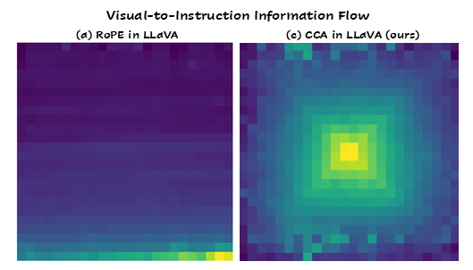

<div align="center">
  
</div>

# Mitigating Object Hallucination via Concentric Causal Attention

This is the official repository of the following paper and a project that study positional perception in LVLMs.
> **Mitigating Object Hallucination via Concentric Causal Attention**<br>
> NeurIPS 2024<br>
> Yun Xing*, Yiheng Li*, Ivan Laptev, Shijian Lu<br>

## 🎉 News

- [2024/10/08] CCA-LLaVA supports evaluation of multiple benchmarks, including `pope`, `chair`, `amber` for hallucination, and `mmstar`, `gqa`, `seed`, `vizwiz_vqa`, `scienceqa` for general LVLM multiple-choice questions. Please refer to [this doc](https://github.com/xing0047/cca-llava/blob/main/docs/Eval.md) for details.
- [2024/10/08] Paper is available on arXiv.
- [2024/09/27] CCA is accepted to NeurIPS 2024🎉.

## 📖 Introduction
Recent Large Vision Language Models (LVLMs) present remarkable zero-shot conversational and reasoning capabilities given multimodal queries. Nevertheless, they suffer from object hallucination, a phenomenon where LVLMs are prone to generate textual responses not factually aligned with image inputs. Our pilot study reveals that object hallucination is closely tied with Rotary Position Encoding (RoPE), a widely adopted positional dependency modeling design in existing LVLMs. Due to the long-term decay in RoPE, LVLMs tend to hallucinate more when relevant visual cues are distant from instruction tokens in the multimodal input sequence. Additionally, we observe a similar effect when reversing the sequential order of visual tokens during multimodal alignment. Our tests indicate that long-term decay in RoPE poses challenges to LVLMs while capturing visual-instruction interactions across long distances. We propose Concentric Causal Attention (CCA), a simple yet effective positional alignment strategy that mitigates the impact of RoPE long-term decay in LVLMs by naturally reducing relative distance between visual and instruction tokens. With CCA, visual tokens can better interact with instruction tokens, thereby enhancing model's perception capability and alleviating object hallucination. Without bells and whistles, our positional alignment method surpasses existing hallucination mitigation strategies by large margins on multiple object hallucination benchmarks.
<div align="center">
  
</div>

## 🛠️ Install
```
conda create -n cca-llava python=3.10 -y
conda activate cca-llava
pip install --upgrade pip  # enable PEP 660 support
conda install pytorch==2.1.1 torchvision==0.16.1 pytorch-cuda=12.1 -c pytorch -c nvidia
pip install -e .
pip install -e ".[train]"
pip install triton==2.1.0 pynvml==11.5.0 --upgrade
pip install flash-attn==2.5.8 --no-build-isolation --no-cache-dir
```

## 🤗 Model
- [cca-llava-1.5-7b](https://huggingface.co/xing0047/cca-llava-1.5-7b)

## 📜 Data
Please refer to [Data.md](https://github.com/xing0047/cca-llava/blob/main/docs/Data.md) for preparation of training data.

## 🔥 Train
CCA-LLaVA training pipeline follows [LLaVA-1.5](https://github.com/haotian-liu/LLaVA). The training consists of two stages:
- **Step 1, pretraining**. Train a projector on a CC3M subset of ∼558K image-text pairs to connect a frozen pretrained vision encoder and a frozen LLM.
  ```
  bash scripts/v1_5/pretrain.cca-llava-1.5-7b.sh
  ```
- **Step 2, instruction tuning**. Fine-tune projector and LLM with ~665k multimodal instruction data.
  ```
  bash scripts/v1_5/finetune.cca-llava-1.5-7b.sh
  ```

## 🔍 Eval
Please refer to [Eval.md](https://github.com/xing0047/cca-llava/blob/main/docs/Eval.md) for details.

## 🕹️ Usage
The two core modifications `concentric positions` and `concentric causal masking` can be found in `llava/cca_utils` folder. To replace default causal scheme with our proposed cca, you can prepend following code to either training or evaluation code, subject to your own use case.
```
import transformers
from llava.cca_utils.cca import llamaforcausallm_forward, cca_forward 
transformers.models.llama.LlamaForCausalLM.forward = llamaforcausallm_forward
transformers.models.llama.LlamaModel.forward = cca_forward
```

## ✒️ Citation
```
@inproceedings{
  xing2024mitigating,
  title={Mitigating Object Hallucination via Concentric Causal Attention},
  author={Yun Xing, Yiheng Li, Ivan Laptev, Shijian Lu},
  booktitle={The Thirty-eighth Annual Conference on Neural Information Processing Systems},
  year={2024},
  url={https://openreview.net/forum?id=CIRPE1bSmV}
}
```

## ❤️ Acknowledgement
Thanks for their wonderful work!
- [LLaVA](https://github.com/haotian-liu/LLaVA): the codebase we use to implement cca.
- [OPERA](https://github.com/shikiw/OPERA): an excellent approach that mitigates object hallucination. the codebase we use to implement CHAIR evaluation.
- [POPE](https://github.com/RUCAIBox/POPE): a widely adopted object hallucination benchmark.
- [AMBER](https://github.com/junyangwang0410/AMBER): a recent comprehensive hallucination benchmark involving object, attribute and relation hallucination.
- [lmms-eval](https://github.com/EvolvingLMMs-Lab/lmms-eval): a comprehensive evaluation toolkit on LVLMs. the codebase we use to implement general LVLM benchmark evaluations.
