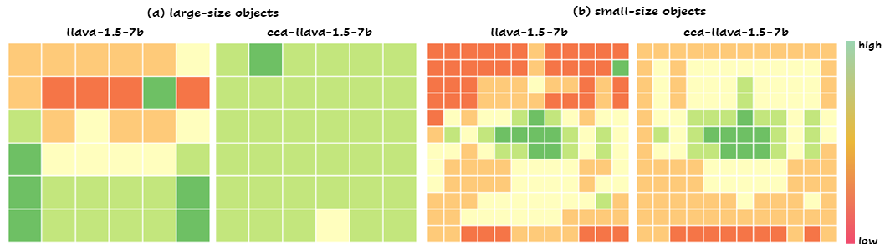

<div align="center">
  
</div>

# Mitigating Object Hallucination via Concentric Causal Attention

This is the official repository of the following paper and a project that study positional perception in LVLMs.
> **[Mitigating Object Hallucination via Concentric Causal Attention](https://github.com/xing0047/cca-llava/blob/main/docs/neurips24_cca.pdf)**<br>
> NeurIPS 2024<br>
> Yun Xing*, Yiheng Li*, Ivan Laptev, Shijian Lu†<br>

## 🎉 News

- [2024/10/21] CCA-LLaVA supports evaluation of multiple benchmarks, including `pope`, `chair`, `amber` for hallucination, and `mmstar`, `gqa`, `seed`, `vizwiz_vqa`, `scienceqa` for general LVLM multiple-choice questions. Please refer to [this doc](https://github.com/xing0047/cca-llava/blob/main/docs/Eval.md) for details.
- [2024/10/21] [Paper](https://github.com/xing0047/cca-llava/blob/main/docs/neurips24_cca.pdf) is available.
- [2024/09/27] CCA is accepted to NeurIPS 2024🎉.

## 🕹️ Approach
- We reveal that **object hallucination** is closely tied with **Rotary Position Encoding** (RoPE), a widely adopted positional dependency modeling design in existing LVLMs. Due to the **long-term decay** in RoPE, LVLMs suffer from **recency bias** and tend to hallucinate more when relevant visual cues are distant from instruction tokens (user query) in the multimodal input sequence.
- Motivated by this, we propose **Concentric Causal Attention (CCA)**, a simple yet effective positional alignment strategy that mitigates the impact of RoPE long-term decay in LVLMs by placing critical visual cues closer to user instructions, thereby alleviating object hallucinations. 
<div align="center">
  
</div>

## 🔥 Spatial Position Probing

- To further verify effectiveness of our approach, we craft a large-scale object hallucination evaluation set, involving over 2,000,000 testing samples that are diverse in object spatial positions and object sizes. Our model surpasses LLaVA-1.5 across diverse spatial positions and object scales consistently. 
<div align="center">
  
</div>

## 🛠️ Install
```
conda create -n cca-llava python=3.10 -y
conda activate cca-llava
pip install --upgrade pip  # enable PEP 660 support
pip install torch==2.1.1 torchvision==0.16.1 torchaudio==2.1.1 --index-url https://download.pytorch.org/whl/cu121
pip install -e .
pip install -e ".[train]"
pip install triton==2.1.0 pynvml==11.5.0 --upgrade
pip install flash-attn==2.5.8 --no-build-isolation --no-cache-dir
```

## 🤗 Model
- [cca-llava-1.5-7b](https://huggingface.co/xing0047/cca-llava-1.5-7b)

## 📜 Data
Please refer to [Data.md](https://github.com/xing0047/cca-llava/blob/main/docs/Data.md) for preparation of training data.

## 🌟 Train
CCA-LLaVA training pipeline follows [LLaVA-1.5](https://github.com/haotian-liu/LLaVA). The training consists of two stages:
- **Step 1, pretraining**. Train a projector on a CC3M subset of ∼558K image-text pairs to connect a frozen pretrained vision encoder and a frozen LLM.
  ```
  bash scripts/v1_5/pretrain.cca-llava-1.5-7b.sh
  ```
- **Step 2, instruction tuning**. Fine-tune projector and LLM with ~665k multimodal instruction data.
  ```
  bash scripts/v1_5/finetune.cca-llava-1.5-7b.sh
  ```

## 🔍 Eval
Please refer to [Eval.md](https://github.com/xing0047/cca-llava/blob/main/docs/Eval.md) for details.

## 🕹️ Usage
The two core modifications `concentric positions` and `concentric causal masking` can be found in `llava/cca_utils` folder. To replace default causal scheme with our proposed cca, you can prepend following code to either training or evaluation code, subject to your own use case.
```
import transformers
from llava.cca_utils.cca import llamaforcausallm_forward, cca_forward 
transformers.models.llama.LlamaForCausalLM.forward = llamaforcausallm_forward
transformers.models.llama.LlamaModel.forward = cca_forward
```

## ✒️ Citation
```
@inproceedings{
  xing2024mitigating,
  title={Mitigating Object Hallucination via Concentric Causal Attention},
  author={Yun Xing, Yiheng Li, Ivan Laptev, Shijian Lu},
  booktitle={The Thirty-eighth Annual Conference on Neural Information Processing Systems},
  year={2024},
  url={https://openreview.net/forum?id=CIRPE1bSmV}
}
```

## ❤️ Acknowledgement
Thanks for their wonderful work!
- [LLaVA](https://github.com/haotian-liu/LLaVA): the codebase we use to implement cca.
- [roformer](https://github.com/ZhuiyiTechnology/roformer): codebase where rope is initially proposed.
- [OPERA](https://github.com/shikiw/OPERA): an excellent approach that mitigates object hallucination. the codebase we use to implement CHAIR evaluation.
- [POPE](https://github.com/RUCAIBox/POPE): a widely adopted object hallucination benchmark.
- [AMBER](https://github.com/junyangwang0410/AMBER): a recent comprehensive hallucination benchmark involving object, attribute and relation hallucination.
- [lmms-eval](https://github.com/EvolvingLMMs-Lab/lmms-eval): a comprehensive evaluation toolkit on LVLMs. the codebase we use to implement general LVLM benchmark evaluations.

